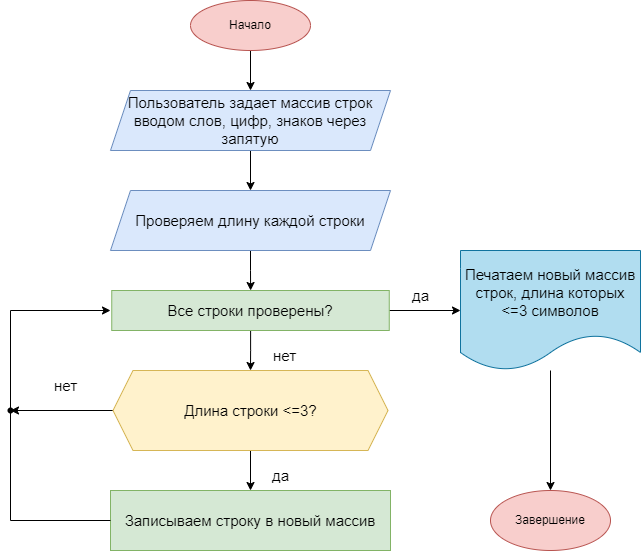

**Итоговая проверочная работа**

**Задача**: *Написать программу, которая из имеющегося массива строк формирует массив из строк, длина которых меньше либо равна 3 символа. Первоначальный массив можно ввести с клавиатуры, либо задать на старте выполнения алгоритма. При решение не рекомендуется пользоваться коллекциями, лучше обойтись исключительно массивами.*

**Описание решения:**

* Пользователь задает массив строк вводом слов, цифр, знаков через запятую

* Определения размер нового массива

* Создаем и заполняем новый массив элементами, удовлетворяющими условию задачи

* Выводим новый массив

